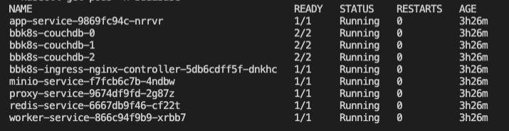
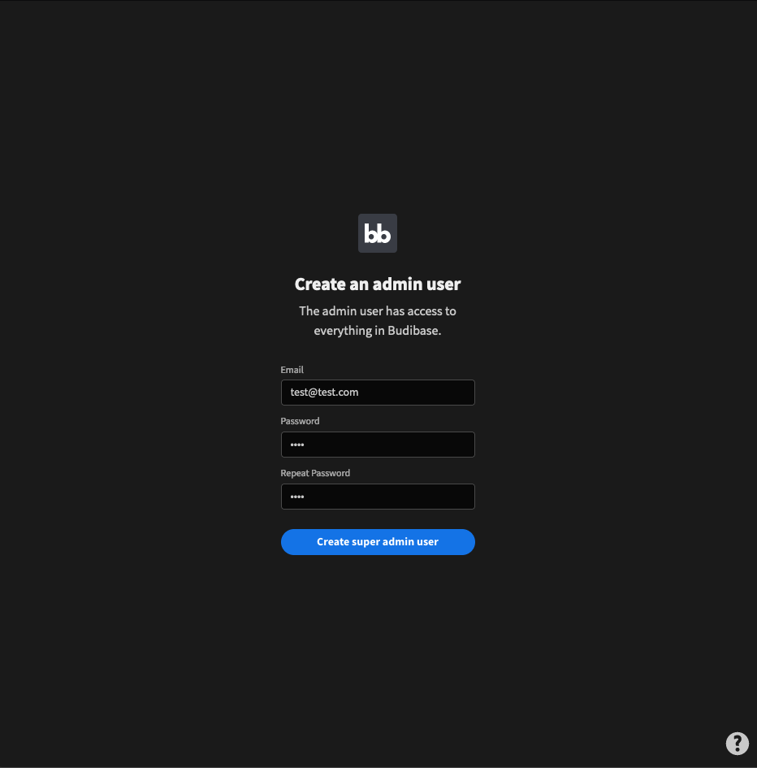

# Kubernetes \(K8S\)

### Prerequisites

There's a few command line utilities we have to set up before we can get started with budibase on kubernetes. Follow the guides below to set up `kubectl` and `helm`.

* `helm` CLI \([https://helm.sh/docs/intro/install/](https://helm.sh/docs/intro/install/)\)
* `kubectl` CLI \([https://kubernetes.io/docs/tasks/tools/\#kubectl](https://kubernetes.io/docs/tasks/tools/#kubectl)\)

We recommend running on K8S nodes with at least 2GB of memory as a minimum,  but we recommend larger instances for higher volume use cases.

### Setting up a Kubernetes Cluster

If you don't already have an existing kubernetes cluster, follow one of the guides below for your provider.

**AWS**

You can set up a kubernetes cluster in AWS using the `eksctl` command line tool and the following guide.



**Google Cloud**

Google cloud platform has direct support for kubernetes. Read the following guide to find out how to set up and configure a K8S cluster in your GCP environment.



**Minikube**

Minikube ****is a development friendly way for you to run a kubernetes cluster on your machine. It's a fantastic way to get started with kubernetes and one of the easiest ways to set up a cluster for experiementation. The guide below details how to create a k8s cluster with minikube. Minikube is not recommended for production installations, however.



 **MicroK8S**

MicroK8S is a lightweight kubernetes offering from canonical that provides some production level features such as clustering. Follow the guide below to set up a kubernetes cluster using MicroK8S.



**K3S**

K3S is another lightweight K8S solution from Rancher. This is a great option if you are already using rancher to manage your kubernetes infrastructure or want a lightweight, single binary fully compliant Kubernetes distribution. Rancher also provide a very easy setup script to install your K3S cluster in the guide below.



### Install **Budibase Helm Chart**

Now that you have your kubernetes cluster up and running, you can now install the budibase helm chart which will provision all the relevant infrastructure for running budibase in a K8S environment. Run the commands below to download the helm chart from our repository, and install it.


**Required:** You must install budibase in a kubernetes namespace called **budibase**. This helps segregate your budibase resources from the rest of your cluster.


```bash
helm repo add budibase https://budibase.github.io/budibase/
helm repo update
helm install --create-namespace --namespace budibase budibase budibase/budibase
```

Wait a few moments as budibase creates all the containers and resources. You can then run `kubectl get pods -n budibase` to see your new budibase installation up and running in your K8S cluster.



Time to build! To use your new installation, you need to get the IP address of your ingress controller. Budibase makes use of the [NGINX ingress controller](https://kubernetes.github.io/ingress-nginx/how-it-works/) to direct incoming traffic to the other budibase services. 

You can access your budibase installation using the IP address of the ingress controller, which you can grab using the following command:

```text
kubectl get ingress -n budibase
```

Visit the ingress URL in your browser and you will see that your budibase installation is up and running.



### \*\*\*\*

### Upgrading your Chart

To get the latest and greatest, you can run the following commands to update the repo and install the latest budibase helm chart to your environment!

```bash
helm repo update
helm upgrade budibase-kubernetes budibase/budibase
```

### Uninstalling the Helm Chart

If you would like to remove all of the budibase resources from your kubernetes cluster, you can run the following command to uninstall everything with helm.

```text
helm uninstall budibase --namespace budibase
```

### Configuration

**Cloud Specific Load Balancers**

By default, budibase configures a basic NGINX ingress controller to route traffic to your budibase services. If you want to run a load balancer for your specific cloud, you can turn off the NGINX ingress controller bundled with budibase and run your own ingress controller for your specific cloud.

```yaml
ingress:
  nginx: false
  aws: true
```

#### **Using a Custom Domain**

If you are using a custom domain for your installation, you need to add it in the `host` section of the ingress controller in `values.yaml`. Notice here how we have added `yourdomain.com`

You should then be able to set up an A record in your DNS provider to point to the URL of your ingress controller.

```yaml
ingress:
  enabled: true
  nginx: true
  className: ""
  annotations: 
    kubernetes.io/ingress.class: nginx
  hosts:
    - host: yourdomain.com
      paths:
      - path: /
        pathType: Prefix
        backend:
          service:
            name: proxy-service
            port:
              number: 10000 
```

#### **Scaling Budibase** 

You can scale up nodes in your installation by updating the `replicaCount` of a given service in the `values.yaml` of the budibase helm chart. For example, if we wanted to scale up the worker and app service due to high load, we can update our `values.yaml` to have a higher `replicaCount`.

```yaml
services:
  dns: cluster.local

  proxy:
    port: 10000
    replicaCount: 1

  apps:
    port: 4002
    replicaCount: 2
    logLevel: info

  worker:
    port: 4001
    replicaCount: 2
```

Once updated, [upgrade your chart](kubernetes.md#upgrading-your-chart) to apply the changes.

#### Secrets Management

If you have `createSecrets` set to `true` in your `values.yaml`, budibase will create the following credentials for you:

* An internal API key, that can be used for API requests.
* a JWT secret
* Object store access key \(if using MinIO\)
* Object store secret key \(if using MinIO\)

If you need to read the value of your secrets, you can do so using `kubectl` and the following commands to read the values out from your k8s secrets:

```text
# for internal API key
kubectl get secret budibase-budibase -o go-template='{{ .data.internalApiKey }}' -n budibase | base64 --decode

# JWT secret
kubectl get secret budibase-budibase -o go-template='{{ .data.jwtSecret }}' -n budibase | base64 --decode

# MinIO Access Key
kubectl get secret budibase-budibase -o go-template='{{ .data.objectStoreAccess }}' -n budibase | base64 --decode

# MinIO Secret Key
kubectl get secret budibase-budibase -o go-template='{{ .data.objectStoreSecret }}' -n budibase | base64 --decode
```

**Redis**

The Budibase helm chart ships with a [redis](https://redis.io/) server that will be included by default. If you want to use your own external redis cluster, you can configure the `values.yaml` file in the helm chart to switch off the budibase one by turning `enabled` off. Here's what your configuration may look like if you wanted to circumvent the default bundled redis and use an external redis cluster hosted on `myrediscluster.io`.

```yaml
  redis:
    enabled: false # disable if using external redis
    port: 6379
    replicaCount: 1
    host: "myrediscluster.io"
    password: "your-redis-password"
```

**CouchDB**

The budibase helm chart will automatically bring up a 3 node couchDB cluster within your environment. If you would rather use an existing CouchDB instance, you can turn off the one budibase supplies and point at your own. Please note - you must set up search in your CouchDB cluster \([https://docs.couchdb.org/en/stable/ddocs/search.html](https://docs.couchdb.org/en/stable/ddocs/search.html)\) in order to use all the search functionality that budibase provides. Below is an example configuration of how you would point budibase to a CouchDB installation hosted on `mycouch.io`

```yaml
  couchdb:
    enabled: false
    replicaCount: 3
    url: "http://mycouch.io:1234"
    user: "couchuser"
    password: "couchpassword"
```

**MinIO/Amazon S3**

Budibase ships with a MinIO server included for object storage. Since MinIO is Amazon S3 compliant, you can switch out the bundled MinIO for an S3 bucket in your AWS account. Here's how your `values.yaml` should look if you want to use S3 instead of MinIO.

```yaml
  objectStore:
    minio: false
    browser: false
    port: 9000
    replicaCount: 1
    accessKey: "your-access-key" # AWS_ACCESS_KEY
    secretKey: "your-secret-key" # AWS_SECRET_ACCESS_KEY
```

### **Troubleshooting**

#### Connection Issues In My Cluster

Make sure that your budibase installation is running in the **budibase** namespace in kubernetes. The proxy that routes traffic to budibase services relies on this.

**Still Having issues?** 

If you need a hand or have discovered a bug, please raise a discussion on our github discussions forum. For kubernetes installations, try to include the following information in your discussion:

* Which K8S provider you are using \(AWS/MiniKube etc\)
* Screenshots/Logs of errors that are occurring
* Screenshots of your `values.yaml` if you have changed any configuration
* Anything else that is relevant to the issue you are having.

[https://github.com/Budibase/budibase/discussions](https://github.com/Budibase/budibase/discussions)

\*\*\*\*

\*\*\*\*

\*\*\*\*


