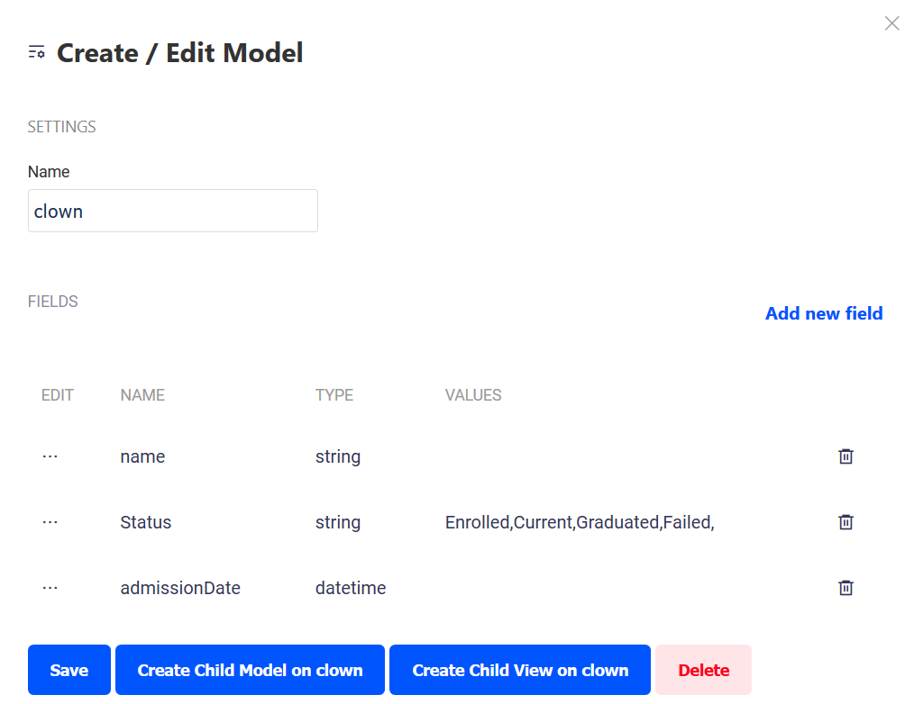

# Child Records

In Clown School, we want to be able to assign "Certifications" to our clown students. As the students learn new skills, they are awarded these certifications.

To describe this in terms of our data, "Certifications belong to clowns" or "We would like to create certification records against our clown records".

This kind of relationship is performed using a "Child Record".

To create this, click on `clown`, in the schema, to open the clown model. Then click on "Create Child Model on Clown":

From here, we will create the "Certification" model, with the following fields:

| Field Name | Description | Type |
| :--- | :--- | :--- |
| Name | The name the certification. allowed values of "Juggling", "Fire Eating", "Unicycle", "Trapeze" | string |
| Status | This can have values of "Scheduled" or "Complete" | string |
| TestDate | Date when the test is to be done, or was done | datetime |

**Note** that once we create the child model, the `certification` model and `all_certifications` view now display underneath `clown`, and are indented. This signifies that they are children of `clown`. Retrieving data from the `all_certifications` model will only retrieve certifications for a particular clown.

