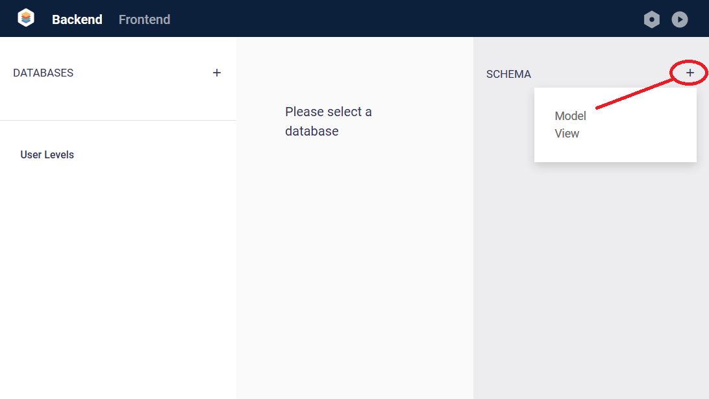

# Backend - Create a Model

The first step to building your app is to define your data.

A "Model" is the basic building block of your database. This is where you define your "Fields". You could think of a model like a "Table", and its fields like "Columns".

From here, you can give your model a name, and add some fields...

