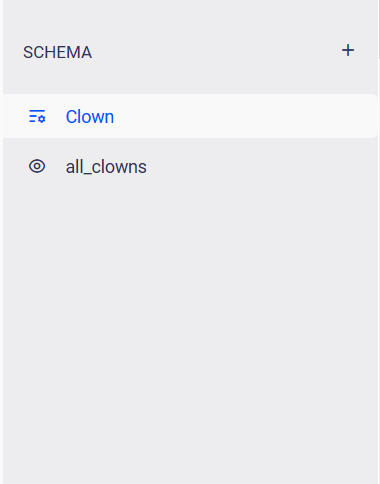

# Default View

Once you have created the clown model, two new items have been added to the "Schema":

- `clown`. The model that you have just created
- `all_clowns`. This is a "view"

## Models vs Views vs Records

You will find these three terms defined in more detail in the "Glossary" section of this documentation. In Summary:

- A **Model** defines the fields for a particular piece of data, i.e. "Column Headers". An example is our "clown" model
- A **Record** is a single piece of data that gets saved by our app and it is always linked to a particular model, like a "Row" in a table. For example, `name: "Crusty the Clown", status: "Graduated"`
- A **View** is used to retrieve a list of records. It's like retrieving "All Graduated Clowns".  You may add a view to a filter

By default, the `all_clowns` view will be used to list all clown records, in our database

