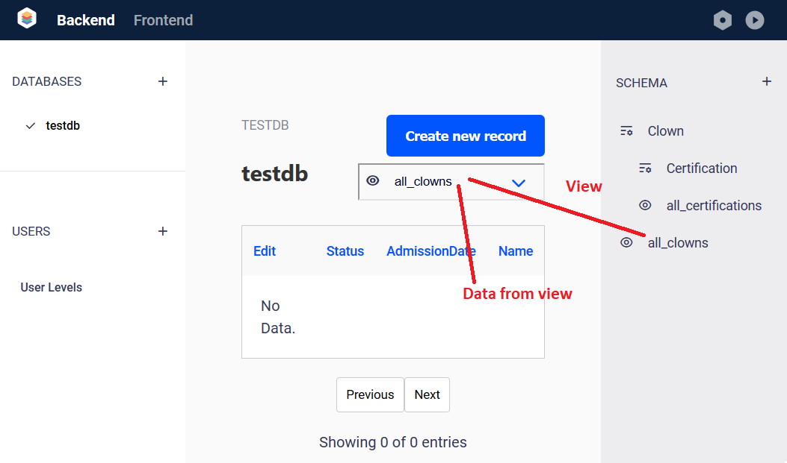

# Managing Test Data

When you select a database, you may create, edit and view data in that database.

The datatable in the middle of the screen displays the data contained in the view that is selected in the dropdown.

Use the "Create New Record" button to create a record.  

It is important to know that when you are creating a record, you are creating it against the whole database - not the selected view. If the record does not meet te filters for the current view, it will not appear in the currently displayed table