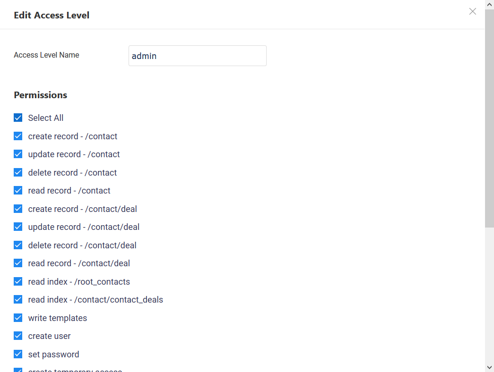

# User Access Levels

Before you can login to your application, you will need to create a user. To create a user, you will need to create a "User Access Level".

A User Access Level defines what actions a user (of this access level) is allowed to perform, i.e. permissions.

For Clown School, we will create an "admin" access level, that has all permissions.

You may assign:

- Create, Read, Update and Delete permissions for each one of your models
- Read permissions for each one of your views
- Other system permissions, for user management, etc.
