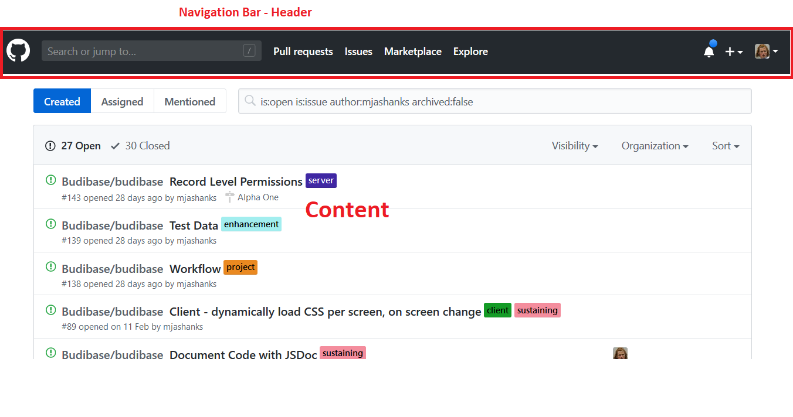

# Page Layout

Every Budibase "Page" (which we will cover later), will have a "Page Layout".

A Page Layout is what defines the basic structure of a page. It remains even as the page's inner content is changed.

A common example of layout would be a page with a Navigation bar header, and content underneath... like GitHub:

Back to the Budibase builder, click on "Page Layout" to start designing:

